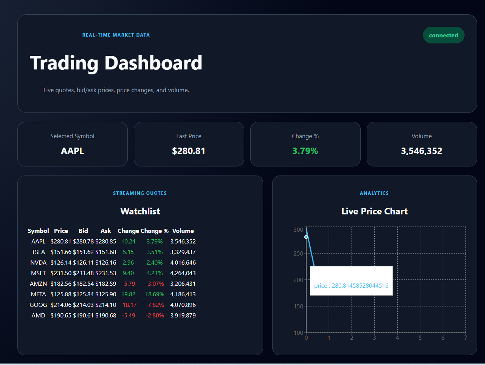
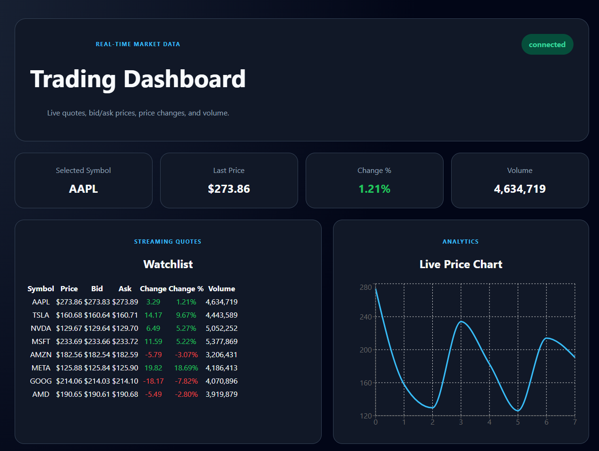

# Real-time Trading UI Demo (Practice Project)

A production-style practice UI for **real-time market dashboards**: streaming quotes, lightweight charts, and an order ticket.
Built to showcase **React performance patterns** and **clean UX** using a WebSocket data stream.

## Tech
- React + TypeScript (Vite)
- WebSockets (mock server with `ws`)
- State management patterns (normalized store + selective subscriptions)

## Features
- **Live Watchlist** with streaming quotes (price, bid/ask, change, volume)
- **Selected Symbol Dashboard** (quote summary + mini chart)
- **Recent Trades** stream (time, price, size, side)
- **Order Ticket** (Market/Limit, Buy/Sell, validation, fake order confirmation)
- **Connection indicator** + auto-reconnect

## Performance Notes (What this demo emphasizes)
- Selective store subscriptions (update only affected rows)
- Memoized row components
- Throttled chart updates to prevent UI jank
- Capped trade history to avoid unbounded renders

## Getting Started
### 1) Install
pnpm install

### 2) Start mock WebSocket server
pnpm dev:server

### 3) Start web app
pnpm dev:web

Web: http://localhost:5173  
WS: ws://localhost:8080

## Project Structure
- `apps/web` – React UI
- `services/mock-ws-server` – WebSocket market simulator

## Screenshots

